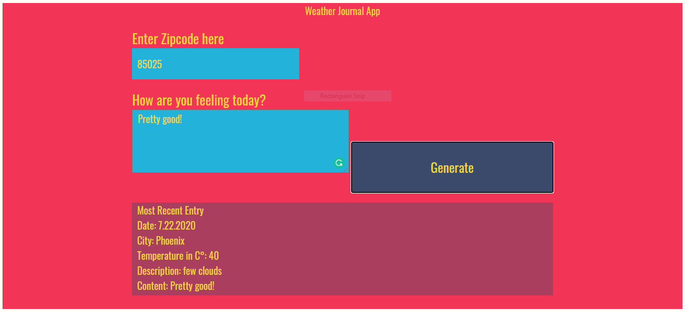

# Weather-Journal App Project

## Table of Contents

- [About the Project](#about-the-project)
- [Installation](#installation)
- [Contributing](#contributing)
- [Technologies Used](#technologies-used)
- [Credits](#credits)
- [License](#license)

### About the Project

- Second project of Egypt FWD initiative with Udacity collaboration.
- Entering a zip code will fire an api call to [OpenWeatherMap](https://openweathermap.org/) to fetch some data including: temperature, city, small description about the weather.
- All made by fetch methods `GET` and `POST`, and javascript `promises`.

### Installation

- On git bash, run `git clone git@github.com:MalakJoseph/weather-journal-app.git && cd ./weather-journal-app && npm install && node server.js`
- Head to the browser and enter `http://localhost:8000`

### Contributing

Now, all pull requests are welcomed!

### Technologies Used

- [Node](https://nodejs.org/en/about/)
- [Express](http://expressjs.com/)
- [cors](https://www.npmjs.com/package/cors)
- [body-parser](https://www.npmjs.com/package/body-parser)

### Credits

Project idea from Udacity Nanodegree program.

### License

This project is licensed under the terms of the MIT license.
